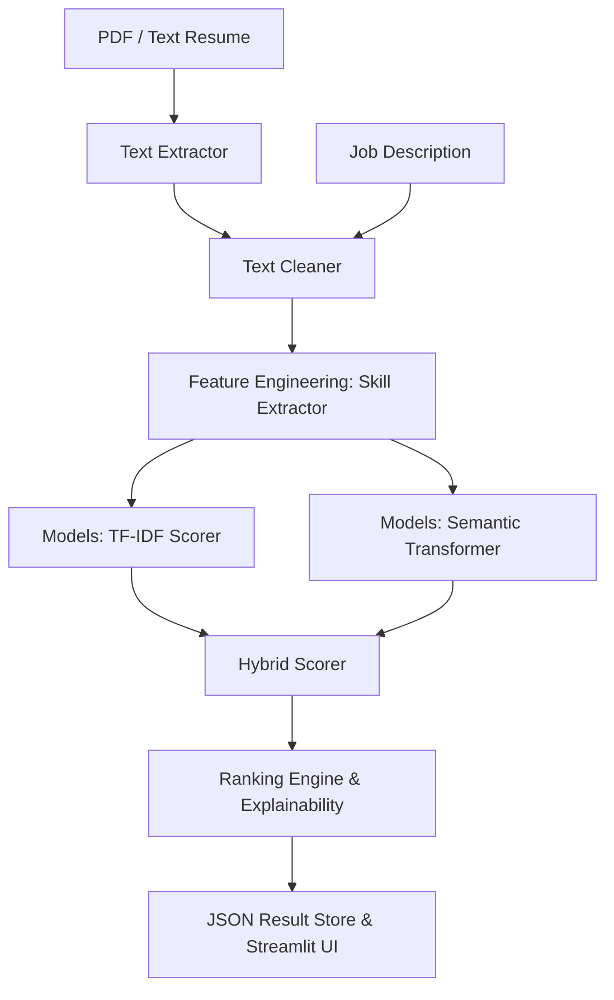

# 🤖 AI Resume Screening & Candidate Ranking System

> **A production-grade ML engineering project leveraging Hybrid NLP (TF-IDF + Semantic Embeddings) and a persistent Vector DB to rank resumes with explainable analytics.**

[](https://python.org)
[](https://fastapi.tiangolo.com)
[](https://streamlit.io)
[](https://trychroma.com)

---

## 📋 Project Overview

The AI Resume Screening & Candidate Ranking System is a **local-first, privacy-focused** ML pipeline for automated resume analysis and ranking. It combines classical NLP (TF-IDF), semantic embeddings (SBERT), and domain-driven skill extraction to deliver explainable, production-grade candidate ranking—**no external LLM APIs required**.

**Key Features:**
- **Hybrid Scoring:** Combines TF-IDF, SBERT semantic similarity, and skill extraction for robust, explainable rankings.
- **Persistent Vector Storage:** Uses ChromaDB for fast, scalable vector search and storage.
- **Explainable Analytics:** Interactive visualizations (Plotly) for skill gaps, pool distribution, and candidate fit.
- **Robust PDF/Text Ingestion:** Handles complex resume layouts with `pdfplumber` and `PyMuPDF`.
- **Modern UI:** Streamlit dashboard for recruiters, with interactive skill chips and result browsing.
- **API-First:** FastAPI backend with OpenAPI docs and Python integration examples.
- **Fully Containerized:** Docker and docker-compose support for easy deployment.

---

## 🏗️ System Architecture



**Component Breakdown:**
- **Data Processing:** PDF/Text extraction, Unicode normalization, lemmatization, and cleaning.
- **Feature Engineering:** Skill extraction using both rule-based and spaCy PhraseMatcher approaches.
- **Scoring Models:**
  - TF-IDF: Keyword-level cosine similarity.
  - Semantic: SBERT (all-MiniLM-L6-v2) for contextual similarity.
- **Ranking Engine:** Combines scores into a hybrid metric (default: 40% TF-IDF, 60% semantic).
- **API & UI:** FastAPI for backend, Streamlit for frontend.
- **Persistence:** ChromaDB for vector storage, SQLite for metadata.

---

## 📁 Project Structure

```
├── api/                # FastAPI backend (main, routes, schemas, db)
├── config/             # Configuration and settings
├── data/               # Skills list, sample resumes
├── data_processing/    # PDF extraction, text cleaning
├── docs/               # API reference, architecture, verification
├── feature_engineering/# Skill extraction logic
├── frontend/           # Streamlit UI
├── models/             # Ranking, scoring, vector store
├── scripts/            # Demo, setup, verification scripts
├── storage/            # Uploaded files, logs, results, vector DB
├── tests/              # Unit and integration tests
├── utils/              # File and logging utilities
├── Dockerfile          # Container build
├── docker-compose.yml  # Multi-service orchestration
├── requirements.txt    # Python dependencies
├── run_api.py          # Launches FastAPI server
├── run_frontend.py     # Launches Streamlit UI
```

---

## 🚀 Setup & Installation

### Prerequisites
- Python **3.11+**
- SQLite (default, no setup needed)
- At least 4GB RAM (for SBERT model)

### 1. Clone & Create Environment
```bash
git clone https://github.com/KailasVS666/candidate-ranking-engine.git
cd candidate-ranking-engine
python -m venv venv
# On Windows:
venv\Scripts\activate
# On Linux/Mac:
source venv/bin/activate
```

### 2. Install Dependencies & Download Models
```bash
pip install -r requirements.txt
python scripts/setup_nlp_models.py
```

### 3. Run the Application
**API (FastAPI):**
```bash
python run_api.py
# API docs: http://localhost:8000/docs
```
**Frontend (Streamlit):**
```bash
python run_frontend.py
# UI: http://localhost:8501
```

### 4. Docker (Optional)
```bash
docker-compose up --build
# API: http://localhost:8000
# UI:  http://localhost:8501
```

---

## 🧑‍💻 Usage

### Upload & Analyze Resumes
1. Open the Streamlit UI (`python run_frontend.py` or Docker).
2. Upload one or more resumes (PDF or TXT).
3. Enter a job description and click "Analyze".
4. View ranked candidates, skill gaps, and analytics.

### API Endpoints
- **Swagger/OpenAPI:** http://localhost:8000/docs
- **Key Endpoints:**
  - `GET /` — Health check
  - `POST /upload_resume` — Upload resumes
  - `POST /analyze` — Analyze and rank candidates
  - `GET /results` — List previous results
  - `DELETE /clear` — Clear session data

#### Example: Analyze via Python
```python
import requests

# Upload resume
with open("resume.txt", "rb") as f:
    requests.post("http://localhost:8000/upload_resume", files={"files": f})

# Analyze
resp = requests.post(
    "http://localhost:8000/analyze",
    data={"job_description": "Senior Data Scientist...", "top_n": 5}
)
print(resp.json()["top_candidates"])
```

---

## 🧪 Testing

Run all tests with:
```bash
pytest
```
Test coverage includes API endpoints, ranking logic, skill extraction, and text cleaning.

---

## 🛠️ Contributing

Contributions are welcome! Please open issues or pull requests for bug fixes, features, or documentation improvements.

---

## 📈 Roadmap

**Phase 2: Production Hardening**
- [ ] Background workers (Celery + Redis)
- [ ] PostgreSQL migration
- [ ] Full Dockerization (API, worker, DB)

**Phase 3: Advanced Intelligence**
- [ ] Cross-encoder re-ranking
- [ ] Experience extraction (NLP)
- [ ] Candidate timeline visualization

---

## 📄 License

MIT — See [LICENSE](LICENSE) for details.

---

> **Built as a demonstration of Production-Grade ML Engineering.**
> *No LLM APIs. No Subscriptions. 100% Local Performance.*
