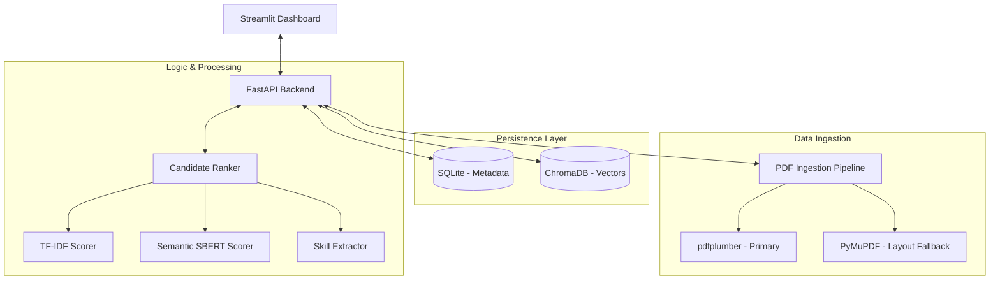

# 🤖 AI Resume Screening & Candidate Ranking System

> **A production-grade ML engineering project that leverages Hybrid NLP (TF-IDF + Semantic Embeddings) and a persistent Vector DB to rank resumes with explainable analytics.**

[](https://python.org)
[](https://fastapi.tiangolo.com)
[](https://streamlit.io)
[](https://trychroma.com)

---

## 📋 Project Status: Phase 1 & 2a COMPLETE
The system is currently fully operational as a high-performance **Local Intelligence** engine. It requires zero external API calls and manages all context via a persistent database.

### ⚡ Key Highlights
*   **Persistent Semantic Storage**: Integrated **ChromaDB** for efficient vector indexing of candidates.
*   **Hybrid Scoring (XAI)**: A multi-pillar ranking engine combining **TF-IDF Keyword Matching**, **SBERT Semantic Context**, and **Domain-Driven Skill Extraction**.
*   **Explainable Analytics**: Interactive radar charts and histograms built with **Plotly** to visualize candidate "fit" across multiple dimensions.
*   **Hardened PDF Ingestion**: A robust extraction pipeline using a `pdfplumber` + `PyMuPDF (fitz)` cascade to handle complex multi-column layouts.
*   **Memory Optimized**: Global singleton model loading architecture to maximize performance on local hardware.

---

## 🏗 System Architecture



---

## 📁 Technical Deep Dive

### 1. Hybrid Ranking Methodology
The engine calculates a `Hybrid Score` by weighting three distinct NLP strategies:
1.  **Semantic Similarity (60%)**: Contextual understanding of experience using `all-MiniLM-L6-v2`.
2.  **Statistical Frequency (20%)**: TF-IDF keyword overlap for direct JD alignment.
3.  **Skill Match Accuracy (20%)**: Direct comparison of extracted skills vs. JD requirements.

### 2. The Vector Database Workflow
Unlike simple memory-based prototypes, this system uses **ChromaDB** to persist candidate embeddings. This allows:
*   **Instant Querying**: No need to re-embed resumes every time you run an analysis.
*   **Persistence**: Your candidate pool survives application restarts.
*   **Scalability**: Ready to handle thousands of resumes without hitting memory limits.

### 3. Explainable AI (XAI) Dashboard
We believe a rank is only as good as its justification. The frontend provides:
*   **Radar Charts**: Visualize the "Fingerprint" of a candidate's strengths.
*   **Pool Distribution**: See how a single candidate compares against the entire average of the uploaded pool.
*   **Skill Gaps**: Highlights precisely which keywords the candidate is missing vs. the JD.

---

## 🚀 Setup & Installation

### Prerequisites
*   Python **3.11+**
*   **SQLite** (Implicit)
*   At least 4GB RAM (For the SBERT model)

### 1. Clone & Environment
```bash
git clone https://github.com/KailasVS666/candidate-ranking-engine.git
cd candidate-ranking-engine
python -m venv venv
source venv/bin/activate  # venv\Scripts\activate on Windows
```

### 2. Install Dependencies
```bash
pip install -r requirements.txt
python scripts/setup_nlp_models.py
```

### 3. Run the Dashboard
```bash
# Terminal 1: API
python run_api.py

# Terminal 2: UI
python run_frontend.py
```

---

## 📈 Future Roadmap

### Phase 2: Production Hardening (Next)
*   [ ] **Background Workers**: Integrate Celery + Redis for asynchronous processing of large batches.
*   [ ] **PostgreSQL Migration**: Move relational metadata to a robust SQL server.
*   [ ] **Dockerization**: Full containerization of the API, Worker, and DB.

### Phase 3: Advanced Intelligence
*   [ ] **Cross-Encoder Re-ranking**: Implement a two-stage retrieval process for SOTA accuracy.
*   [ ] **Experience Extraction**: Weigh candidates by "Years of Experience" extracted via NLP.
*   [ ] **Candidate Timeline**: Visualize career progression on the dashboard.

---

## 📄 License
MIT — See [LICENSE](LICENSE) for details.

---
> **Built as a demonstration of Production-Grade ML Engineering.**  
> *No LLM APIs. No Subscriptions. 100% Local Performance.*
