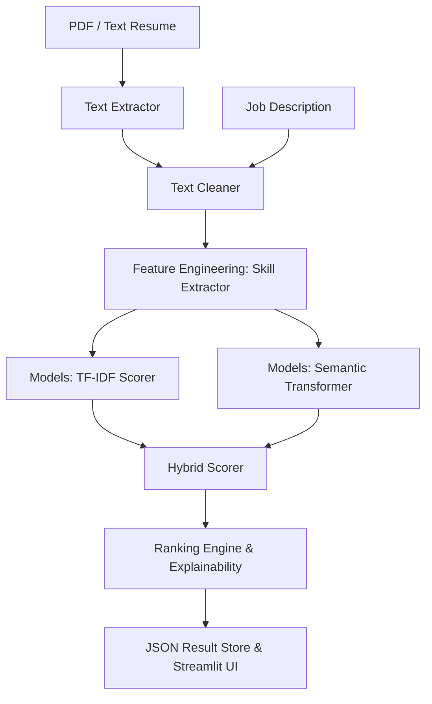

# System Architecture & Logic

The AI Resume Screening System is a modular, local-first ML pipeline. It prioritizes data privacy and uses classical NLP for both speed and explainability.

---

## 🏗 High-Level Architecture

---

## 🛠 Component Breakdown

### 1. Data Processing (`data_processing/`)
- **PDF Extractor**: Multi-engine support (`pdfplumber` + `PyMuPDF`).
- **Text Cleaner**: 10-step pipeline including Unicode normalization, URL/Email removal, and NLTK-based lemmatization.

### 2. Feature Engineering (`feature_engineering/`)
- **Skill Extractor**: Hybrid matching using both rule-based keyword search (170+ skills) and `spaCy` PhraseMatcher. It calculates "Matched," "Missing," and "Extra" skills for every candidate.

### 3. Scoring Models (`models/`)
- **TF-IDF Scorer**: Measures keyword-level similarity (Cosine Similarity). Fast and reliable for exact keyword matches.
- **Semantic Scorer**: Uses `Sentence-Transformers` (`all-MiniLM-L6-v2`) to encode resumes into 384-dimensional dense vectors. Captures meaning even without keyword overlap.

### 4. Ranking Engine (`models/ranker.py`)
- The Ranker orchestrates the entire flow. It combines the TF-IDF and Semantic scores into a **Hybrid Score** (Default: 40/60 weighting). This provides a balanced view of keyword relevance vs general semantic fit.

### 5. API & UI (`api/` & `frontend/`)
- **FastAPI**: Provides a RESTful interface for uploads and analysis.
- **Streamlit**: Provides a premium, dark-themed UI for recruiters to view rankings and interactive skill chips.

---

## 🔒 Local-First Design
- **No External APIs**: All models run on your CPU/GPU locally.
- **Zero Inferencing Costs**: No cost per resume scanned.
- **Privacy**: No resume data ever leaves your computer.
